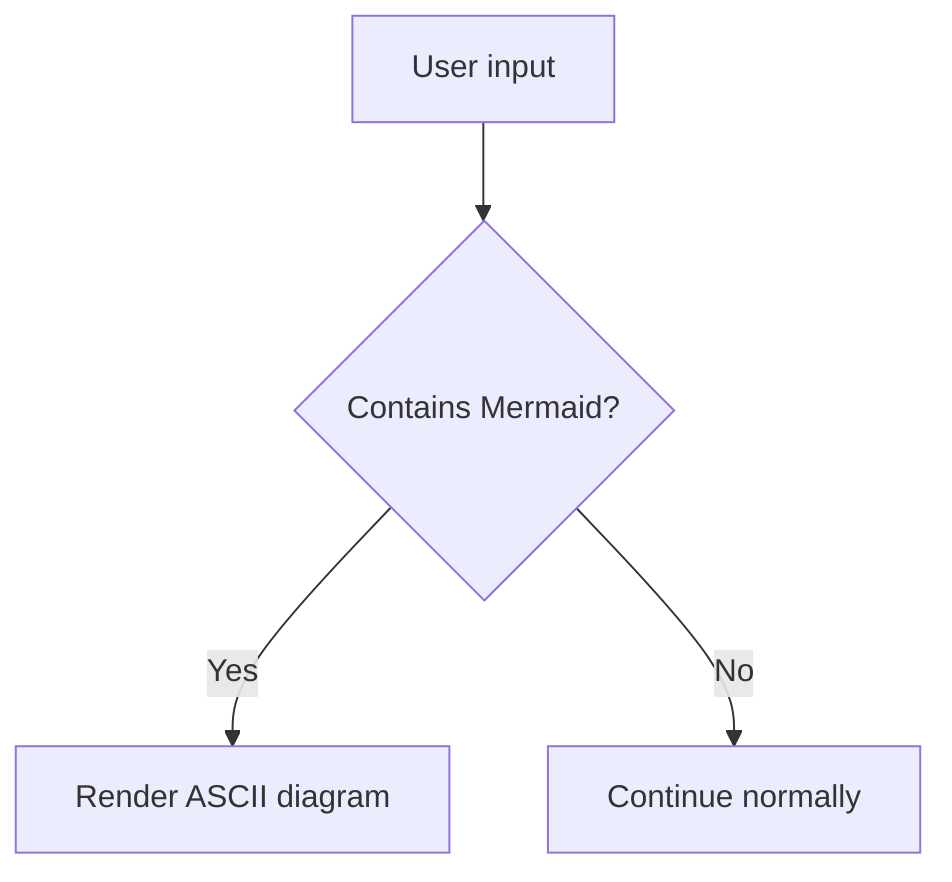

# pi-mermaid-viewer

Render Mermaid fenced code blocks from Pi user input and assistant output as ASCII diagrams in the TUI.

## Install

```bash
pi install npm:pi-mermaid-viewer
```

Then restart Pi or run:

```txt
/reload
```

## Usage

Write or ask for a Mermaid fenced block:

````md

````

The extension automatically renders diagrams from:

- user input
- assistant output

No slash command is registered.

## Supported diagram types

- `graph` / `flowchart`
- `sequenceDiagram`
- `classDiagram`
- `erDiagram`
- `stateDiagram` / `stateDiagram-v2`

## Behavior

- Shows full diagrams by default.
- Chooses tighter ASCII layouts for narrow terminals.
- Clips lines that still exceed terminal width.
- Expanding the rendered message shows the original Mermaid source.
- Large inputs are guarded with block, line, and character limits.

## Dependencies

- [`beautiful-mermaid`](https://github.com/lukilabs/beautiful-mermaid) for ASCII rendering
- [`mermaid`](https://github.com/mermaid-js/mermaid) for syntax validation when available

## License

MIT
