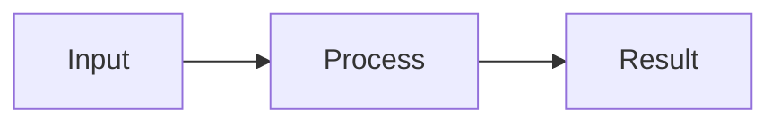
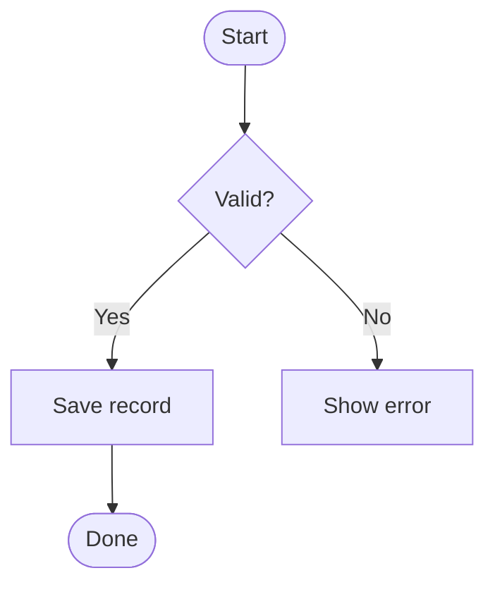
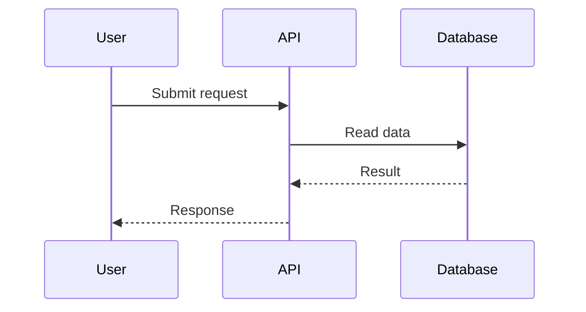
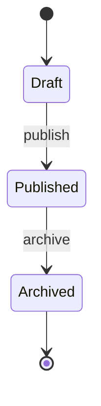

# Mermaid diagrams

Write each diagram as one closed fenced block:

Pi renders closed `mermaid` fences inline natively. Keep the source fence in the response so it remains editable and portable.

## Workflow

1. Choose the smallest diagram type that answers the request: `flowchart`, `sequenceDiagram`, `stateDiagram-v2`, `erDiagram`, `classDiagram`, `gantt`, or `journey`.
2. Give every node a stable ASCII identifier and put readable text in its label.
3. Use one diagram for one concept. Split unrelated flows.
4. Emit a complete, closed Mermaid fence. Do not put prose inside the fence.
5. If rendering reports an error, repair the Mermaid source and return a replacement closed fence.

## Reliable patterns

### Workflow

### Sequence

### State machine

## Constraints

- Prefer short labels; quote or bracket labels containing punctuation that Mermaid could parse as syntax.
- Avoid HTML, click handlers, and external links unless explicitly requested.
- Do not claim a diagram is valid unless it rendered successfully.
- For a user-provided diagram, preserve its meaning and make the smallest syntax correction.
